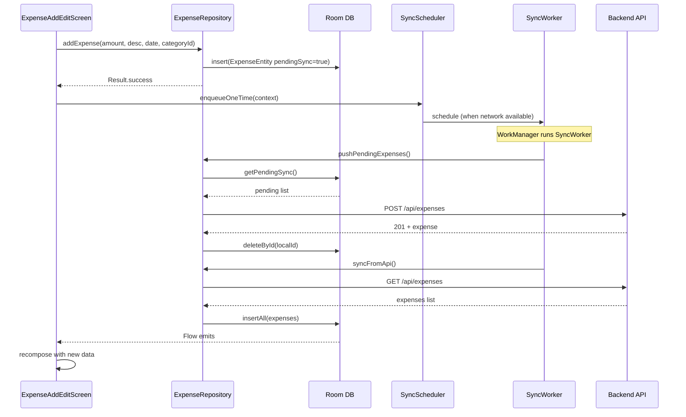
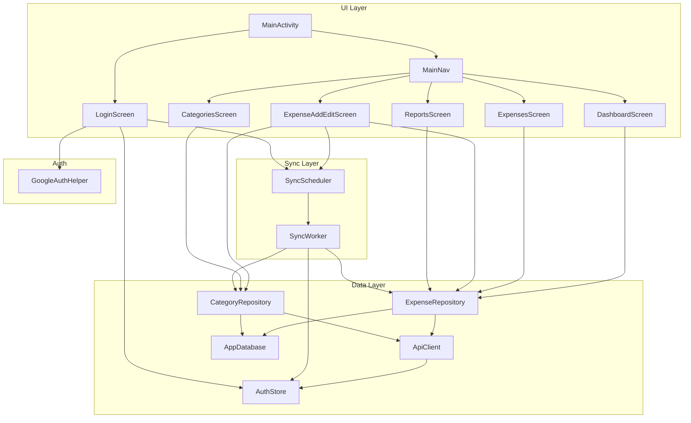
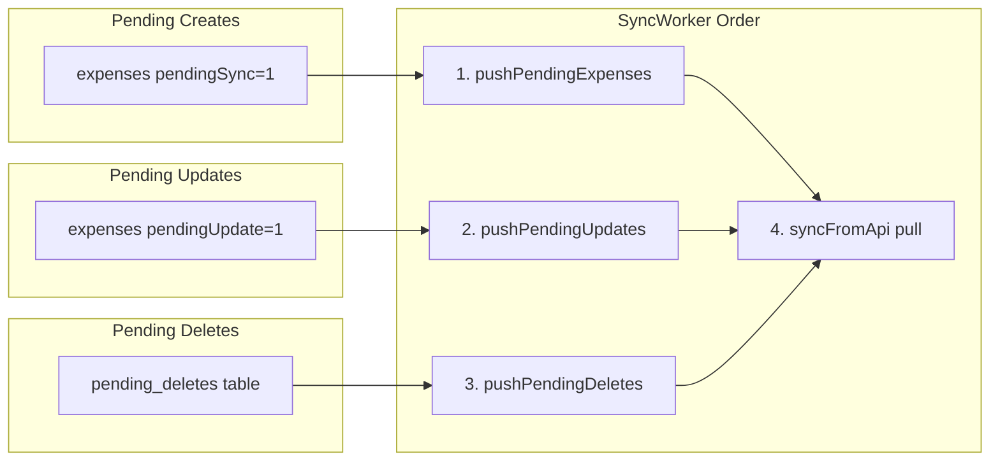

# Low-Level Design Document – Expense Tracker Android App

## Table of Contents

1. [Overview](#1-overview)
2. [Architecture Pattern](#2-architecture-pattern)
3. [Project Structure](#3-project-structure)
4. [UI Layer](#4-ui-layer)
5. [Data Layer](#5-data-layer)
6. [Sync Layer](#6-sync-layer)
7. [Auth Layer](#7-auth-layer)
8. [Backend API (Reference)](#8-backend-api-reference)
9. [Data Flow Diagrams](#9-data-flow-diagrams)
10. [Standard Patterns and References](#10-standard-patterns-and-references)

---

## 1. Overview

The Expense Tracker Android app is a **local-first** expense management application. Users add, edit, and delete expenses locally; a background sync worker pushes changes to a REST API and pulls the latest data for consistency across devices.

**Key characteristics:**
- **Local-first:** All mutations write to Room first; UI never waits on the network.
- **Offline-capable:** Works without connectivity; sync runs when network is available.
- **Multi-user:** Shared family expenses; each expense is attributed to a user.

---

## 2. Architecture Pattern

The app uses a **simplified MVVM-like** structure with **Repository + Compose**:

| Layer | Pattern | Implementation |
|-------|---------|----------------|
| **UI** | Compose + direct Repository access | Screens observe `Flow` from repositories via `collectAsState()`; no ViewModels. |
| **Data** | Repository pattern | `ExpenseRepository`, `CategoryRepository` abstract Room + API. |
| **Sync** | WorkManager | `SyncWorker` runs in background; `SyncScheduler` enqueues work. |
| **Auth** | Token-based | `AuthStore` (EncryptedSharedPreferences) + `GoogleAuthHelper`. |

**Why not full MVVM?**  
The app is small; screens pass `ExpenseTrackerApp` and call `app.expenseRepository` directly. Adding ViewModels would be a natural next step for:
- Screen-level state (loading, error)
- Surviving configuration changes
- Unit testing UI logic

**References:**
- [Guide to app architecture (Android)](https://developer.android.com/topic/architecture)
- [Repository pattern](https://developer.android.com/topic/architecture/data-layer#repositories)

---

## 3. Project Structure

```
com.prembhaskal.expensetracker/
├── ExpenseTrackerApp.kt          # Application: DI container, init
├── MainActivity.kt                # Single Activity, Compose root
├── data/
│   ├── auth/
│   │   ├── AuthStore.kt           # Access + refresh token storage (EncryptedSharedPreferences)
│   │   └── GoogleAuthHelper.kt   # Google Sign-In, ID token
│   ├── local/
│   │   ├── AppDatabase.kt         # Room database, migrations
│   │   ├── dao/                   # ExpenseDao, CategoryDao, Pending*Dao
│   │   └── entity/                # ExpenseEntity, CategoryEntity, Pending*Entity
│   ├── remote/
│   │   ├── ApiClient.kt           # OkHttp REST client
│   │   └── ApiDto.kt              # DTOs for JSON
│   └── repository/
│       ├── ExpenseRepository.kt   # Expense CRUD + sync
│       └── CategoryRepository.kt  # Category CRUD + sync
├── sync/
│   ├── SyncWorker.kt              # WorkManager worker: push + pull
│   └── SyncScheduler.kt           # Enqueue one-time / periodic sync
├── ui/
│   ├── login/LoginScreen.kt
│   ├── nav/MainNav.kt             # NavHost, bottom nav, routes
│   ├── dashboard/DashboardScreen.kt
│   ├── expenses/ExpensesScreen.kt, ExpenseAddEditScreen.kt
│   ├── categories/CategoriesScreen.kt
│   ├── reports/ReportsScreen.kt
│   └── theme/                    # Color, Theme, Type
└── util/
    └── FileLogger.kt              # Debug file logger
```

---

## 4. UI Layer

### 4.1 Entry Point

**MainActivity** is a single-Activity app using Jetpack Compose:

```kotlin
// MainActivity.kt
setContent {
    SharedExpenseManagerTheme {
        var isLoggedIn by remember { mutableStateOf(app.authStore.isLoggedIn()) }
        if (!isLoggedIn) {
            LoginScreen(app, onLoginSuccess = { isLoggedIn = true })
        } else {
            MainNav(app, onSignOut = { ... })
        }
    }
}
```

- **Auth gate:** If not logged in, show `LoginScreen`; else show `MainNav`.
- **State:** `isLoggedIn` is held in `remember`; sign-out clears `AuthStore` and sets it to `false`.

### 4.2 Navigation

**MainNav** uses `NavHost` + bottom `NavigationBar`:

| Route | Screen | Purpose |
|-------|--------|---------|
| `dashboard` | DashboardScreen | Recent expenses, FAB to add |
| `expenses` | ExpensesScreen | Full list, tap to edit |
| `categories` | CategoriesScreen | Manage categories |
| `reports` | ReportsScreen | Monthly totals, by category |
| `add_expense` | ExpenseAddEditScreen | Add new expense |
| `edit_expense/{id}` | ExpenseAddEditScreen | Edit existing |

**Reference:** [Navigation Compose](https://developer.android.com/jetpack/compose/navigation)

### 4.3 Screen Pattern

Screens receive `ExpenseTrackerApp` and observe data via `Flow.collectAsState()`:

```kotlin
// DashboardScreen.kt (typical pattern)
@Composable
fun DashboardScreen(app: ExpenseTrackerApp, onAddExpense: () -> Unit) {
    val recent by app.expenseRepository.getRecentExpenses(20).collectAsState(initial = emptyList())
    // ... render LazyColumn with items(recent)
}
```

- **Data source:** Repository exposes `Flow<List<ExpenseEntity>>`.
- **Recomposition:** When Room emits new data, `collectAsState` updates and the UI recomposes.
- **No ViewModel:** Logic is minimal; repositories handle business rules.

### 4.4 UI Components

| Component | Location | Role |
|-----------|----------|------|
| Scaffold | MainNav | TopAppBar, bottom NavigationBar, content area |
| LazyColumn | Dashboard, Expenses, Reports | Lists |
| OutlinedTextField | ExpenseAddEditScreen, CategoriesScreen | Inputs |
| DatePickerDialog | ExpenseAddEditScreen | Date selection (Material3) |
| ExposedDropdownMenuBox | ExpenseAddEditScreen | Category dropdown with filter |

**Reference:** [Material Design 3 in Compose](https://developer.android.com/jetpack/compose/designsystems/material3)

---

## 5. Data Layer

### 5.1 Room Database

**AppDatabase** is a singleton with four DAOs:

| DAO | Table(s) | Role |
|-----|---------|------|
| ExpenseDao | expenses | CRUD, pending sync queries |
| CategoryDao | categories | CRUD, pending sync |
| PendingDeleteDao | pending_deletes | Queue of expense IDs to delete on server |
| PendingCategoryDeleteDao | pending_category_deletes | Queue of category IDs to delete |

**Schema (simplified):**

```
expenses: id, amount, description, date, categoryId, userId, createdAt, updatedAt,
          categoryName, addedByName, pendingSync, pendingUpdate
categories: id, name, color, createdAt, pendingSync
pending_deletes: expenseId
pending_category_deletes: categoryId
```

**Reference:** [Room persistence library](https://developer.android.com/training/data-storage/room)

### 5.2 Entities

**ExpenseEntity** – main expense model. `pendingSync` and `pendingUpdate` drive sync:

- `pendingSync = true`: Local-only; sync worker will POST to API, then delete from Room.
- `pendingUpdate = true`, `pendingSync = false`: Already on server; sync worker will PATCH, then clear flag.
- Delete: If synced, add to `pending_deletes`; if pending, just delete from Room.

**Reference:** [Defining data using Room entities](https://developer.android.com/training/data-storage/room/defining-data)

### 5.3 Repository Pattern

**ExpenseRepository** abstracts local + remote:

| Method | Behavior |
|--------|----------|
| `addExpense` | Insert into Room with `pendingSync = true`; return immediately |
| `updateExpense` | Update Room, set `pendingUpdate = true` |
| `deleteExpense` | Delete from Room; if was synced, insert into `pending_deletes` |
| `pushPendingExpenses` | Used by SyncWorker: POST pending, delete from Room |
| `pushPendingUpdates` | PATCH pending, clear flag |
| `pushPendingDeletes` | DELETE on server, remove from queue |
| `syncFromApi` | GET from API, `insertAll` (REPLACE) into Room |

**Reference:** [Repository pattern](https://developer.android.com/topic/architecture/data-layer#repositories)

### 5.4 ApiClient

**ApiClient** uses OkHttp + Gson for REST:

- **Auth:** Interceptor adds `Authorization: Bearer <token>` from `tokenProvider()`.
- **Token refresh:** On 401, interceptor calls `POST /api/auth/refresh` with `refresh_token`, updates `AuthStore`, and retries the request. Uses `synchronized(refreshLock)` to avoid concurrent refreshes. Request bodies are buffered before send so retries can replay them.
- **Endpoints:** `/api/expenses`, `/api/categories`, `/api/auth/session`, `/api/auth/refresh`.
- **DTOs:** `ExpenseDto`, `CategoryDto`, `AuthSessionResponse` in `ApiDto.kt`.

**Reference:** [OkHttp](https://square.github.io/okhttp/)

---

## 6. Sync Layer

### 6.1 SyncWorker

**SyncWorker** (WorkManager) runs on `Dispatchers.IO`:

1. Check `authStore.isLoggedIn()`; if not, return `Result.success()` (no-op).
2. Push: `pushPendingExpenses` → `pushPendingUpdates` → `pushPendingDeletes`.
3. Pull: `syncFromApi` (expenses), `pushPendingCategories`, `pushPendingCategoryDeletes`, `syncFromApi` (categories).
4. If any step fails: `Result.retry()`; else `Result.success()`.

**Reference:** [WorkManager](https://developer.android.com/topic/libraries/architecture/workmanager)

### 6.2 SyncScheduler

| Method | When | Work type |
|--------|------|-----------|
| `enqueueOneTime` | After login, add/update/delete | One-time, `REPLACE` |
| `enqueuePeriodic` | App startup | Every 15 min |

**Constraint:** `NetworkType.CONNECTED` – work runs only when network is available.

### 6.3 Sync Flow (High Level)

```
UI mutation (add/update/delete)
    → Repository writes to Room
    → SyncScheduler.enqueueOneTime(context)
    → WorkManager schedules SyncWorker (when network available)
    → SyncWorker: push pending → pull from API
    → Room updated → Flow emits → UI recomposes
```

---

## 7. Auth Layer

### 7.1 AuthStore

**AuthStore** uses `EncryptedSharedPreferences` to store access and refresh tokens:

- `setSession(accessToken, refreshToken)`: Persist both tokens after login or refresh.
- `getToken()`: Used by ApiClient interceptor for `Authorization` header.
- `getRefreshToken()`: Used by ApiClient when refreshing expired tokens.
- `clear()`: On sign-out.
- `isLoggedIn()`: `!getToken().isNullOrBlank()`.

**Reference:** [EncryptedSharedPreferences](https://developer.android.com/reference/androidx/security/crypto/EncryptedSharedPreferences)

### 7.2 GoogleAuthHelper

- **Sign-in:** `getSignInIntent()` → `ActivityResultContracts.StartActivityForResult`.
- **ID token:** `getIdTokenFromResult(data)` extracts `idToken` from Google Sign-In result.
- **Sign-out:** `signOut()` clears Google session.

**Reference:** [Google Sign-In for Android](https://developers.google.com/identity/sign-in/android)

### 7.3 Login Flow

```
User taps "Sign in with Google"
    → GoogleAuthHelper.getSignInIntent()
    → Activity result: getIdTokenFromResult(data)
    → ApiClient.loginWithIdToken(idToken)  → POST /api/auth/session
    → AuthStore.setSession(session.accessToken, session.refreshToken)
    → SyncScheduler.enqueueOneTime(context)
    → onLoginSuccess() → MainNav
```

### 7.4 Token Refresh Flow

Access tokens expire (typically ~1 hour). When an API call returns 401:

```
API returns 401
    → ApiClient interceptor checks: not /api/auth/refresh, has refresh_token
    → synchronized(refreshLock): tryRefresh(refreshToken)
    → POST /api/auth/refresh { refresh_token }
    → AuthStore.setSession(newAccessToken, newRefreshToken)
    → Retry original request with new token
```

If refresh fails or no refresh token exists, the 401 propagates (caller handles; user may need to re-login).

---

## 8. Backend API (Reference)

The Android app talks to a **Next.js API** deployed on Vercel. The API uses **Supabase** for auth and Postgres.

| Endpoint | Method | Purpose |
|----------|--------|---------|
| `/api/auth/session` | POST | Exchange Google ID token for Supabase access + refresh tokens |
| `/api/auth/refresh` | POST | Exchange refresh token for new access + refresh tokens |
| `/api/expenses` | GET | List expenses (paginated) |
| `/api/expenses` | POST | Create expense |
| `/api/expenses/:id` | PATCH | Update expense |
| `/api/expenses/:id` | DELETE | Delete expense |
| `/api/categories` | GET, POST | List / create categories |
| `/api/categories/:id` | PATCH, DELETE | Update / delete category |

**Auth:** All endpoints (except `/api/auth/session` and `/api/auth/refresh`) require `Authorization: Bearer <access_token>`. The app refreshes expired tokens automatically via `/api/auth/refresh`.

---

## 9. Data Flow Diagrams

### 9.1 Add Expense Flow



### 9.2 Architecture Layers



### 9.3 Local-First Sync Queue



---

## 10. Standard Patterns and References

| Pattern / Technology | Usage | Reference |
|----------------------|-------|-----------|
| **Jetpack Compose** | UI | [Compose overview](https://developer.android.com/jetpack/compose) |
| **State hoisting** | `collectAsState`, `mutableStateOf` | [State in Compose](https://developer.android.com/jetpack/compose/state) |
| **Navigation Compose** | NavHost, routes | [Navigation](https://developer.android.com/jetpack/compose/navigation) |
| **Room** | Local DB | [Room](https://developer.android.com/training/data-storage/room) |
| **Flow** | Reactive streams from Room | [Kotlin Flow](https://kotlinlang.org/docs/flow.html) |
| **WorkManager** | Background sync | [WorkManager](https://developer.android.com/topic/libraries/architecture/workmanager) |
| **Repository** | Data abstraction | [Data layer](https://developer.android.com/topic/architecture/data-layer) |
| **EncryptedSharedPreferences** | Token storage | [Security](https://developer.android.com/reference/androidx/security/crypto/EncryptedSharedPreferences) |
| **Google Sign-In** | OAuth | [Google Sign-In](https://developers.google.com/identity/sign-in/android) |
| **OkHttp** | HTTP client | [OkHttp](https://square.github.io/okhttp/) |
| **Gson** | JSON | [Gson](https://github.com/google/gson) |

---

## Summary

- **Architecture:** Simplified MVVM (Repository + Compose, no ViewModels).
- **UI:** Single Activity, Compose, NavHost, screens observe `Flow` from repositories.
- **Data:** Room (local-first), Repository, ApiClient (REST).
- **Sync:** WorkManager, push-then-pull, network constraint.
- **Auth:** Google Sign-In → ID token → API session → EncryptedSharedPreferences (access + refresh tokens). Expired tokens are refreshed automatically on 401.

To extend the app, add new screens in `ui/`, wire them in `MainNav`, and use existing repositories. For more complex screens, introduce ViewModels and move logic out of Composables.
